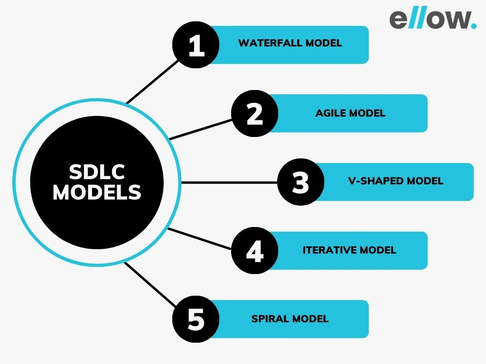
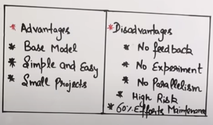
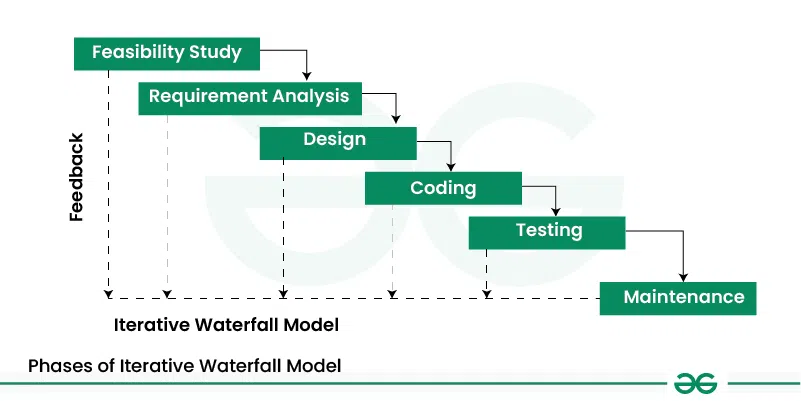
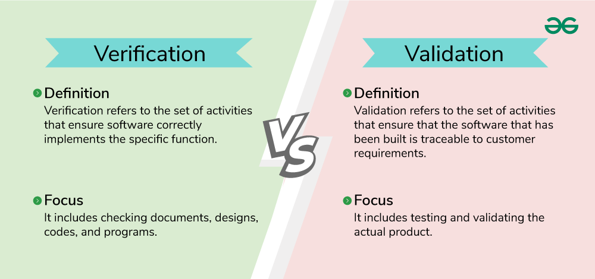
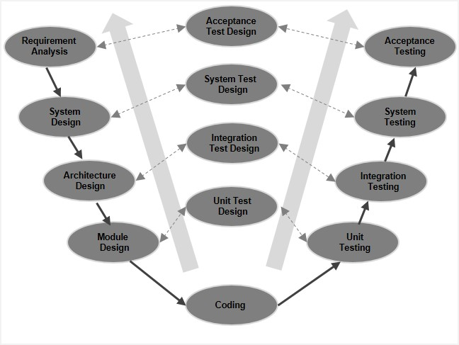
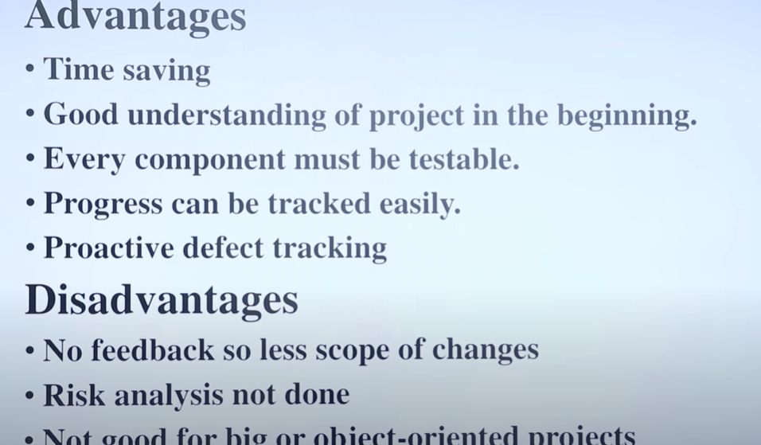
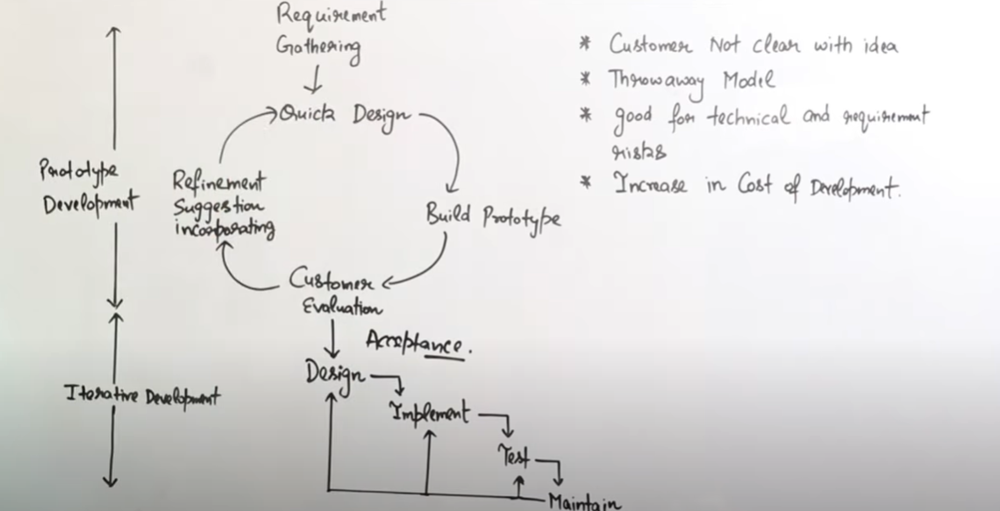
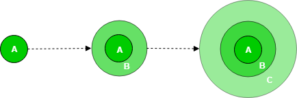
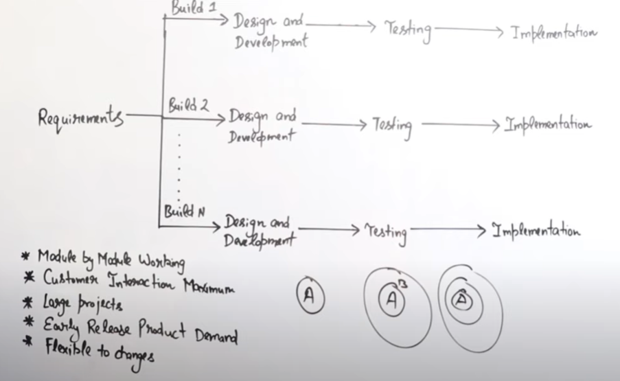

# Software Engineering

## **#1 Introduction**

Software Engineering is the process of designing, developing, testing, and maintaining software. It is a systematic and disciplined approach to software development that aims to create high-quality, reliable, and maintainable software.

> **First `38` pages of the pdf**

 
 

## **#2 SDLC & Software Development Models**

## <u> SDLC </u>

> **PDF Page: `39-46`**

## <u> SDLC Models</u>

selection of correct development model plays an important role in overall quaaity of s/w

> _We have `Waterfall` and `Spiral` Model in the syllabus only_
> 

<!-- All models ony by one -->

### 1. Waterfall model

> **PDF Page: `47-54`**

**_When to Use Waterfall Model?_**

- `Well-understood Requirements`: Before beginning development, there are precise, reliable, and thoroughly documented requirements available.
- `Very Little Changes Expected`: During development, very little adjustments or expansions to the project’s scope are anticipated.
- `Small to Medium-Sized Projects`: Ideal for more manageable projects with a clear development path and little complexity.
- `Predictable`: Projects that are predictable, low-risk, and able to be addressed early in the development life cycle are those that have known, controllable risks.

### 2. Iterative Waterfall model

It allows for improvements and changes to be made at each stage of the development process, instead of waiting until the end of the project. The Iterative Waterfall Model provides **feedback** paths from every phase to its preceding phases, which is the main difference from the classical Waterfall Model.

### 3. V Shaped model

The V-model is an SDLC model where execution of processes happens in a sequential manner in a V-shape. It is also known as **Verification and Validation model**.

- The V-Model is an extension of the waterfall model
- The testing is associated with every phase of development cycle
- there are **Verification phases** (Requirement Analysis, Sys Design, Architectural Design, Module Design) on one side of the ‘V’ and **Validation phases** on the other side. The Coding Phase joins the two sides of the V-Model.

> 

> Validation Phases

`Requirement Analysis` - Gather and analyze user needs.

`System Design` - Define overall system architecture and functionality. (House design)

`Architecture Design` - Plan system structure, modules, and interactions. (a specific Floor design)

`Module Design` - Design individual software components or modules. (Room design)

> Coding Phase

Implement the designed system using programming languages.

> Validation Phases

`Unit Testing` - Validate the functionality of individual modules.

`Unit Test Design` - Create test cases for individual modules.

`Integration Testing` - Verify communication between integrated modules.

`Integration Test Design` - Plan tests to check module interactions.

`System Testing` - Ensure the system meets technical specifications.

`System Test Design` - Prepare test cases to validate the complete system.

`Acceptance Testing` - Verify if the system meets business and user requirements.

`Acceptance Test Design` - Define test cases for user validation.

### 3. Prototype model

> PDF page: 54-60

    What is Software Prototyping?

    Prototype is a working model of software with some limited functionality. The prototype does not always hold the exact logic used in the actual software application

### 4. Incremental Process Model

> PDF page: `70-72`

First, a simple working system implementing only a few basic features is built and then that is delivered to the customer. Then thereafter many successive versions are implemented and delivered to the customer until the desired system is released.
(Eg: s/w updates)

> 

### 5. Evolutionary Development Model

> PDF page: `68-69`

### 5. Spiral Model

> PDF page: `64-67`

### 5. RAD (Rapid Application Development) Model

> PDF page: `61-63`

[RAD VS SDLC](https://www.geeksforgeeks.org/software-engineering-rad-model-vs-traditional-sdlc/)

<!-- Agile dev -->
