# <center>Software Engineering

## [In A Single Video](https://www.youtube.com/watch?v=NlLM3sVF8wY)

# **#1 Introduction**

Software Engineering is the process of designing, developing, testing, and maintaining software. It is a systematic and disciplined approach to software development that aims to create high-quality, reliable, and maintainable software.

> **First `38` pages of the pdf**

<br>
<br>

## **#2 SDLC & Software Development Models**

## <u> SDLC </u>

> **PDF Page: `39-46`**

## <u> SDLC Models</u>

selection of correct development model plays an important role in overall quaaity of s/w

> _We have `Waterfall` and `Spiral` Model in the syllabus only_ > 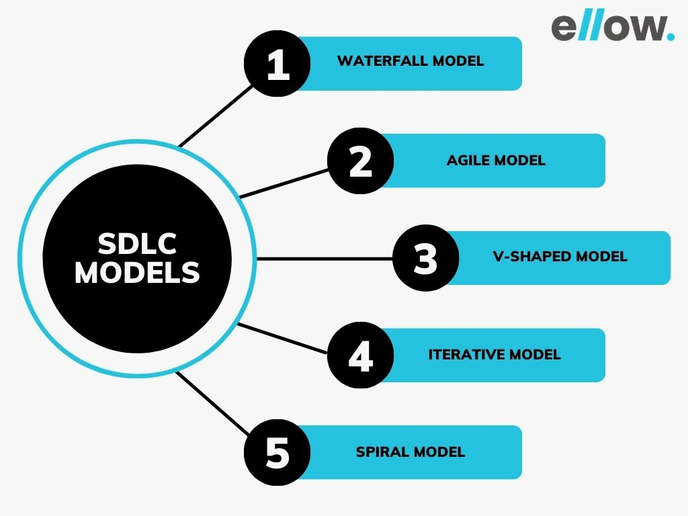

<!-- All models ony by one -->

### 1. Waterfall model

> **PDF Page: `47-54`**


**_When to Use Waterfall Model?_**

- `Well-understood Requirements`: Before beginning development, there are precise, reliable, and thoroughly documented requirements available.
- `Very Little Changes Expected`: During development, very little adjustments or expansions to the project’s scope are anticipated.
- `Small to Medium-Sized Projects`: Ideal for more manageable projects with a clear development path and little complexity.
- `Predictable`: Projects that are predictable, low-risk, and able to be addressed early in the development life cycle are those that have known, controllable risks.

### 2. Iterative Waterfall model

It allows for improvements and changes to be made at each stage of the development process, instead of waiting until the end of the project. The Iterative Waterfall Model provides **feedback** paths from every phase to its preceding phases, which is the main difference from the classical Waterfall Model.

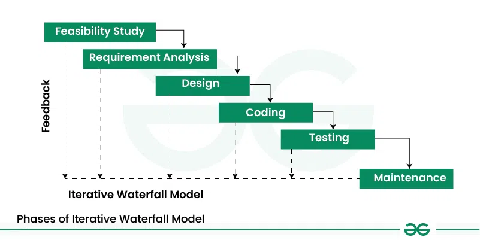

### 3. V Shaped model

The V-model is an SDLC model where execution of processes happens in a sequential manner in a V-shape. It is also known as **Verification and Validation model**.

- The V-Model is an extension of the waterfall model
- The testing is associated with every phase of development cycle
- there are **Verification phases** (Requirement Analysis, Sys Design, Architectural Design, Module Design) on one side of the ‘V’ and **Validation phases** on the other side. The Coding Phase joins the two sides of the V-Model.

> 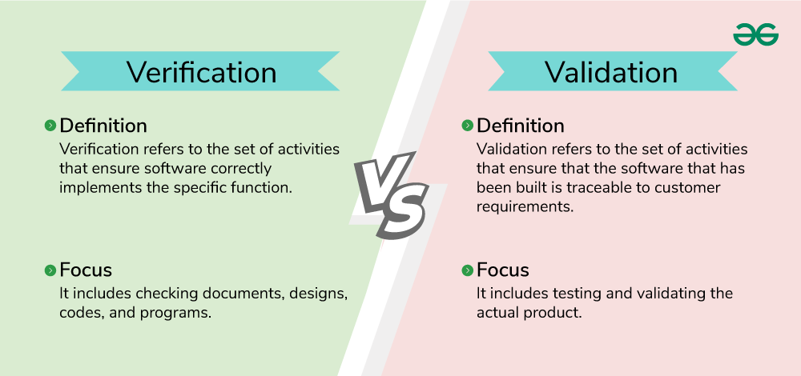

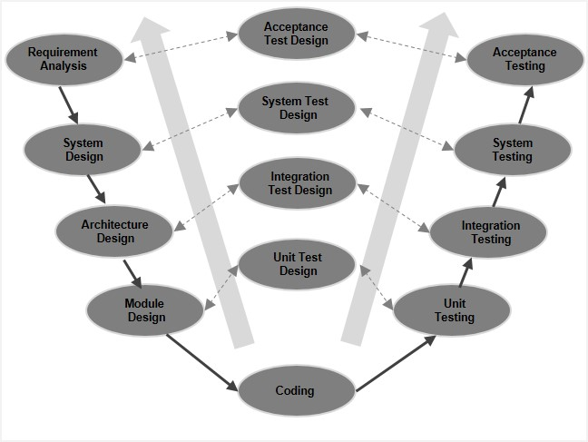

> verification Phases

`Requirement Analysis` - Gather and analyze user needs.

`System Design` - Define overall system architecture and functionality. (House design)

`Architecture Design` - Plan system structure, modules, and interactions. (a specific Floor design)

`Module Design` - Design individual software components or modules. (Room design)

> Coding Phase

Implement the designed system using programming languages.

> Validation Phases

`Unit Testing` - Validate the functionality of individual modules.

`Unit Test Design` - Create test cases for individual modules.

`Integration Testing` - Verify communication between integrated modules.

`Integration Test Design` - Plan tests to check module interactions.

`System Testing` - Ensure the system meets technical specifications.

`System Test Design` - Prepare test cases to validate the complete system.

`Acceptance Testing` - Verify if the system meets business and user requirements.

`Acceptance Test Design` - Define test cases for user validation.

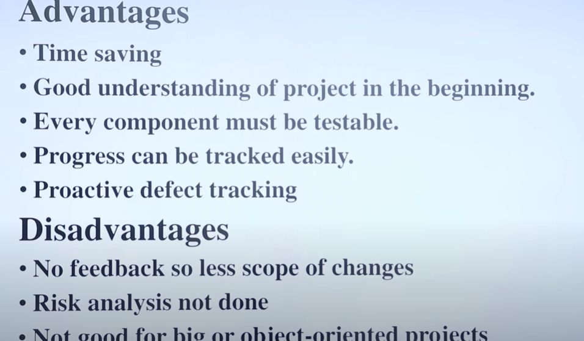

### 3. Prototype model

> PDF page: 54-60

    What is Software Prototyping?

    Prototype is a working model of software with some limited functionality. The prototype does not always hold the exact logic used in the actual software application

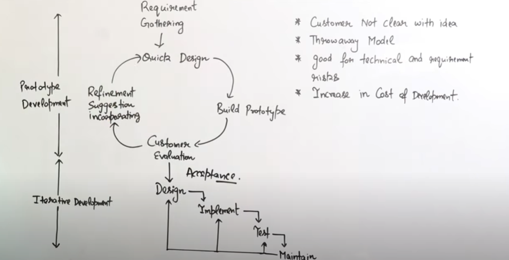

### 4. Incremental Process Model

> PDF page: `70-72`

First, a simple working system implementing only a few basic features is built and then that is delivered to the customer. Then thereafter many successive versions are implemented and delivered to the customer until the desired system is released.
(Eg: s/w updates)

> 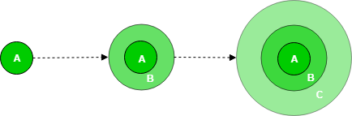

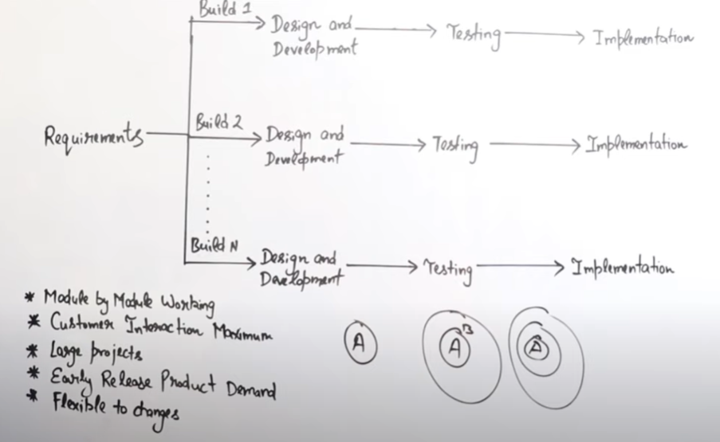

### 5. Evolutionary Development Model

in Incremental Process Model the SRS document is defined there after the development process starts, oncec starts there is no feedback, but here has..

> PDF page: `68-69`

### 5. Spiral Model

The Spiral Model in software engineering is a risk-driven process model used to guide software development projects. It combines elements of both iterative and waterfall models, emphasizing risk management and incremental development. The model is particularly useful for large, complex, and high-risk projects where it’s important to carefully consider potential risks throughout the development process.

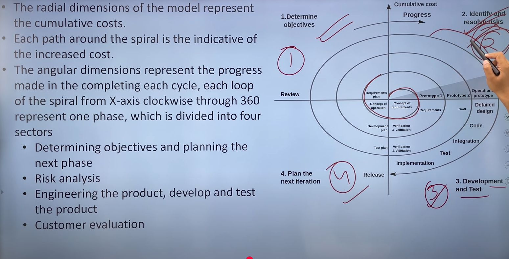

**Phases in Each Spiral**: Each cycle or iteration of the spiral typically includes the following four phases:

- **Planning**: Determine goals, objectives, and requirements for the next iteration, and set priorities.

- **Risk Analysis**: Identify and evaluate risks, such as technical challenges, resource constraints, or changes in user requirements. This phase helps in deciding how to proceed in the next cycle.

- **Engineering**: Perform development tasks (design, coding, and testing). At the end of each spiral, a working prototype or the actual product may be produced.

- **Evaluation**: At the end of each iteration, the progress is evaluated by stakeholders to decide whether to proceed with the next spiral, make adjustments, or halt the project.

> PDF page: `64-67`

### 5. RAD (Rapid Application Development) Model

> PDF page: `61-63`

[RAD VS SDLC](https://www.geeksforgeeks.org/software-engineering-rad-model-vs-traditional-sdlc/)

<!-- Agile dev -->

### 6. Agile (Also a SDLC model)

Agile is a way of developing software that focuses on **flexibility**, **teamwork**, and **continuous improvement**. Instead of planning everything in advance and working on a project for months before showing results, Agile **breaks the project into small parts (called `Iterations`)**. Each iteration usually lasts 1-4 weeks, and after each one, the team shows what they have built, gets feedback, and makes improvements.

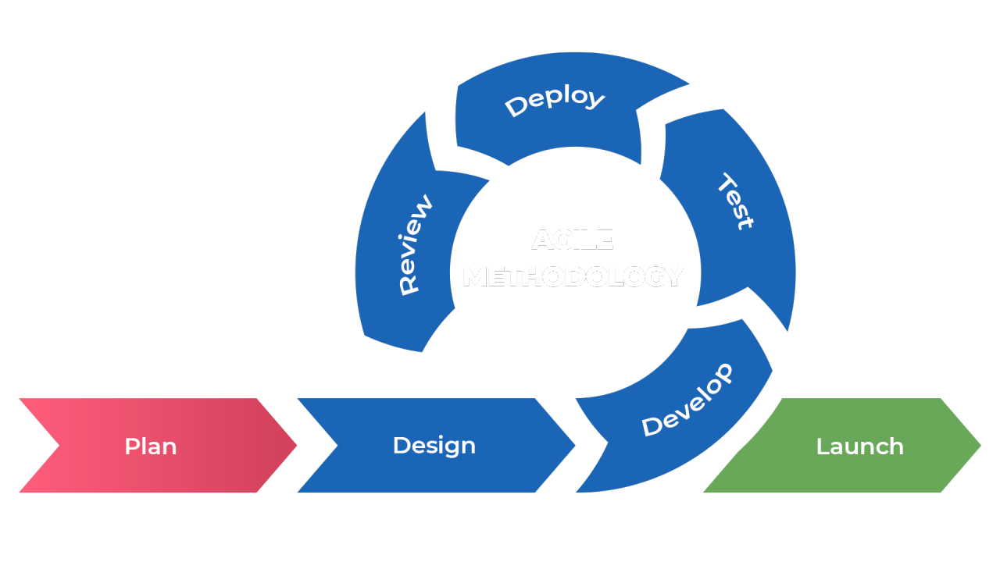

### Key Principles of Agile

Agile follows the **Agile Manifesto**, which prioritizes:

- **Individuals and interactions over processes and tools:**
  Agile emphasizes the importance of human collaboration and communication

- **working software over comprehensive documentation:** Agile prioritizes delivering tangible, working software over exhaustive documentation

- **Customer collaboration over contract negotiation:** Agile promotes active involvement of customers and stakeholders throughout the development process.

- **Responding to change over following a plan:** Agile embraces change as a natural part of the development process.

### Agile frameworks

- Scrum – Uses short sprints (1-4 weeks) and daily stand-up meetings.

- Kanban – Uses a visual board to manage tasks and workflow.

- Extreme Programming (XP) – Focuses on coding best practices and frequent testing.

All of these follow Agile principles but have different ways of organizing work. 🚀

### 7. scrum model

Scrum is a popular Agile framework used for software development. It helps teams work in small, time-boxed cycles called `sprints` (usually 1-4 weeks long). At the end of each sprint, a working part of the software is delivered, tested, and improved based on feedback.

### Key Roles in Scrum:

- `Product Owner` – Decides what needs to be built (sets priorities).
- `Scrum Master` – Ensures the team follows Scrum rules and removes obstacles.
- `Development Team` – Builds the software and delivers features in sprints.

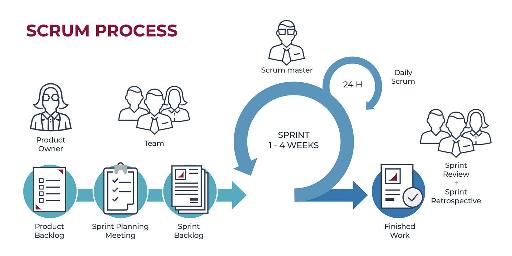

- **backlog** is a to-do list of all the tasks and features that need to be developed.

- **Product Backlog** – A list of all features, fixes, and improvements for the whole project.

- **Sprint Backlog** – A list of tasks selected from the product backlog to be completed in the current sprint.

- **Sprint Retrospective** - is a meeting held at the end of a sprint in Scrum. The team discusses:
  What went well ✅
  What went wrong ❌
  What can be improved 🔄

---

<br>

# <center> software Requirement

Requirement Analysis is a crucial phase in the Software Development Life Cycle (SDLC) where the goal is to understand what the users need from a software system. It's the process of gathering, analyzing, documenting, and validating the requirements of a software project.

### Purpose of Requirement Analysis

- To identify what the users want the system to do.

- To avoid misunderstandings between clients and developers.

- To set the **foundation** for design, development, and testing.

- To ensure the final product meets the business goals and user needs.

### Stages of Requirement Analysis

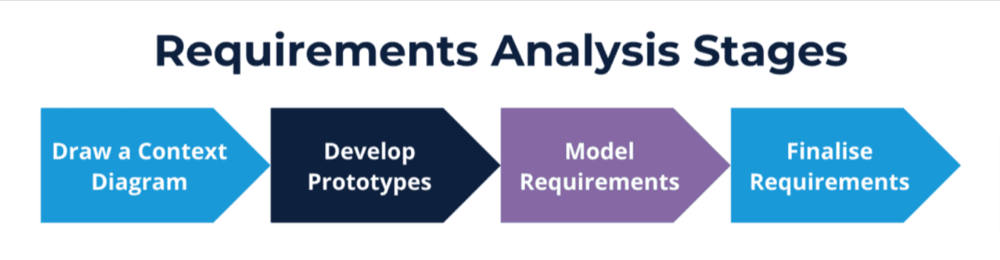

1. **Draw a Context Diagram**

   - Shows the system’s boundary and its interaction with external entities (users, other systems).

   - Helps identify inputs and outputs.

2. **Develop Prototypes**

   - Create mock user interfaces or system flows.

   - Helps stakeholders visualize the system and give
     feedback early.

3. **Model Requirements**

   - Use tools like Use Case Diagrams, DFDs, or ER Models.

   - Makes complex requirements easier to understand and analyze.

4. **Finalize Requirements**

   - Confirm all requirements are clear, complete, and agreed upon.

   - Prepare the final Software Requirements Specification (SRS) document.

## Requirements Types - Food Delivery App

### 1. Functional Requirements (What the system should do)

These are the **specific features or functions** the app must provide.

**Examples:**

- Users can **search for restaurants** and food items.
- Users can **place an order** and make **online payment**.
- The app should **track order delivery status** in real-time.
- Delivery partners can **accept or reject** delivery requests.
- Admin can **add or remove** restaurants from the system.

---

### 2. Non-Functional Requirements (How the system should behave)

These define **quality attributes**, **performance**, or **constraints** of the system.

**Examples:**

- The app should **load within 3 seconds** on mobile devices.
- Must support **up to 1 million users concurrently**.
- Must provide **secure payment gateway** with **encryption**.
- The UI should be **easy to use** and **accessible**.
- System should have **99.9% uptime**.

---

### 3. Domain Requirements (Specific to the industry or field)

These are requirements based on **rules, standards, or needs** of the domain — here, the **food delivery industry**.

**Examples:**

- Must support **multiple tax rates** (GST, VAT) depending on region.
- Must **comply with food safety regulations**.
- Allow **restaurant-specific delivery hours** and **menu customization**.
- Integrate with **restaurant POS systems** for order sync.

---

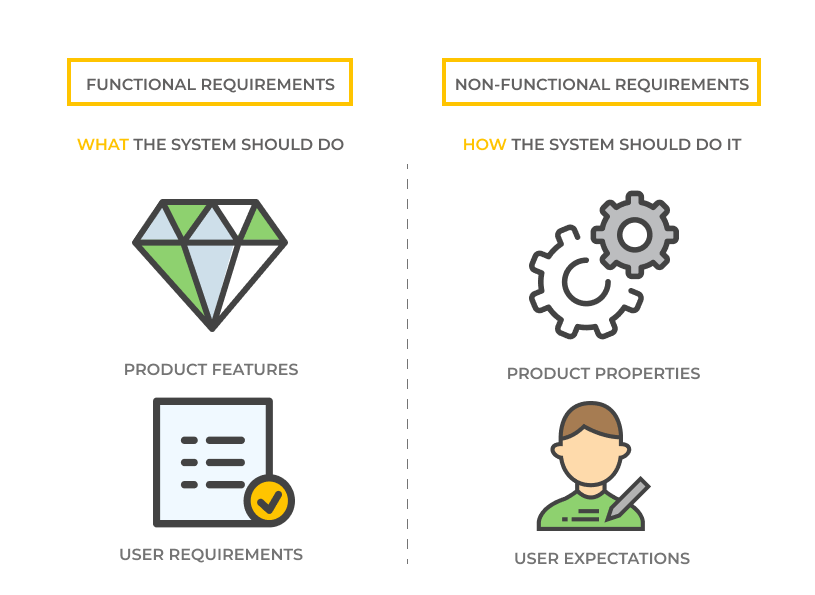

## Structured Analysis

**Structured Analysis** is a **traditional method** in software engineering used to **analyze and model system requirements** in a **clear, logical, and graphical way**.

---

### ✍️ Key Points:

- Focuses on **what** the system should do, not how.
- Uses **diagrams** like:
  - **Data Flow Diagrams (DFD)**
  - **Entity-Relationship Diagrams (ERD)**
  - **State Transition Diagrams**
- Helps **break down complex systems** into smaller, understandable parts.
- Often used during the **requirement analysis phase** of SDLC.

---

### ✅ Example:

For a **Library Management System**, structured analysis might include:

- A **DFD** showing how users borrow books.
- An **ER diagram** of books, members, and transactions.

> Expolore the tools in PDF-1 : 78 [imp]

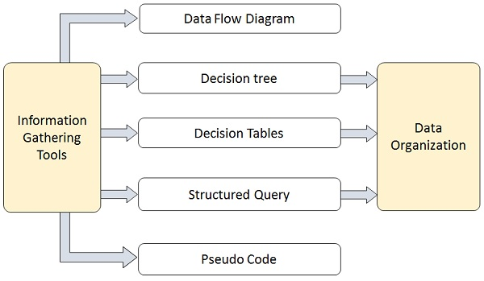

This diagram represents the **Structured Analysis** method used during the **Requirement Analysis** phase of system development.

---

## 🧩 Components in the Diagram

### ✅ 1. Information Gathering Tools

These tools are used to collect system requirements from stakeholders. Examples include:

- Interviews
- Questionnaires
- Observations
- Document Analysis

Collected information is then used in various modeling techniques.

---

## 🔁 2. Analysis & Modeling Techniques

These tools help structure and analyze the gathered information:

- **Data Flow Diagram (DFD)**  
  Visualizes how data flows within the system (processes, data stores, sources/sinks).

- **Decision Tree**  
  A graphical representation of decisions and their outcomes.

- **Decision Tables**  
  A tabular method for representing complex decision logic.

- **Structured Query**  
  Organized representation of data queries (often related to databases).

- **Pseudo Code**  
  A simplified, human-readable way to describe logic and processes before actual coding.

---

## 📦 3. Data Organization

The purpose of all the above tools is to **organize** the collected and analyzed data. This structured information serves as a foundation for the system's design and development.

## DFD

​A Data Flow Diagram (DFD) is a visual tool used in system analysis to depict how data moves through a system. It illustrates the flow of information, the processes that transform data, data storage points, and the external entities interacting with the system

### Components of a DFD

- `Processes`: Represented by `circles` or rounded rectangles, processes show the transformation of data within the system.​

- `Data Stores`: Depicted as `open-ended rectangles` or `parallel lines`, data stores indicate where data is held for later use.​

- `Data Flows`: `Arrows` that illustrate the direction and movement of data between processes, data stores, and external entities.​

- `External Entities`: `Squares` or rectangles that represent outside systems or actors that interact with the system, such as users or other systems.

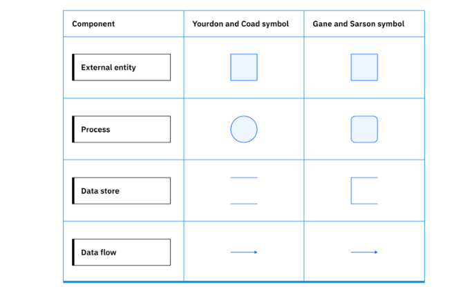

## Data Flow Diagram (DFD) – Levels and Types

### 🧭 Types of DFD

### 1. **Logical DFD**

- Focuses on **what** the system does.
- Shows **business operations**, **data flow**, and **process logic**.
- Doesn’t include technical details like database names, devices, or software.

**Example:**
A logical DFD for a Library System might show:

- Processes: Register Member, Issue Book, Return Book
- Data Stores: Book List, Member Info
- Entities: Member, Librarian

### 2. **Physical DFD**

- Shows **how** the system is or will be implemented.
- Includes hardware, software, files, people, and systems involved.
- Useful for system designers and developers.

**Example:**
A physical DFD of the same Library System might show:

- MySQL database storing book info
- RFID scanners as input devices
- Web interface for book searching

---

### 🔢 Levels of DFD

### **Level 0: Context Diagram**

- The **highest-level** DFD (also called a context diagram).
- Shows the **entire system** as a single process.
- Shows **external entities** and **major data flows**.

**Example (Library System):**

[Member] --> (Library System) --> [Book Info]

### **Level 1 DFD**

- Breaks the Level 0 process into **sub-processes**.
- Shows **main system functions** and **data stores**.
- More detail than the context diagram.

**Example:**

[Member] --> (Register Member) --> (Issue Book) <--> [Book DB] --> (Return Book)

### **Level 2 DFD**

- Breaks a Level 1 process into **even smaller sub-processes**.
- Offers **greater detail**, showing specific actions and data interactions.

**Example:**
Process (Issue Book) from Level 1 could break into:

- Check Book Availability
- Verify Member Status
- Update Book DB
- Record Transaction

### [Watch This Video](https://youtu.be/sqCwE0SLTuw?si=a2sUnrFpZfHA9Ul9)

## Data Dictionary

Data Dictionary is a centralized repository that contains definitions and descriptions of all data elements used in a system. It's essentially a catalog of data that provides detailed information about each data item, helping ensure consistency and clarity across the project.

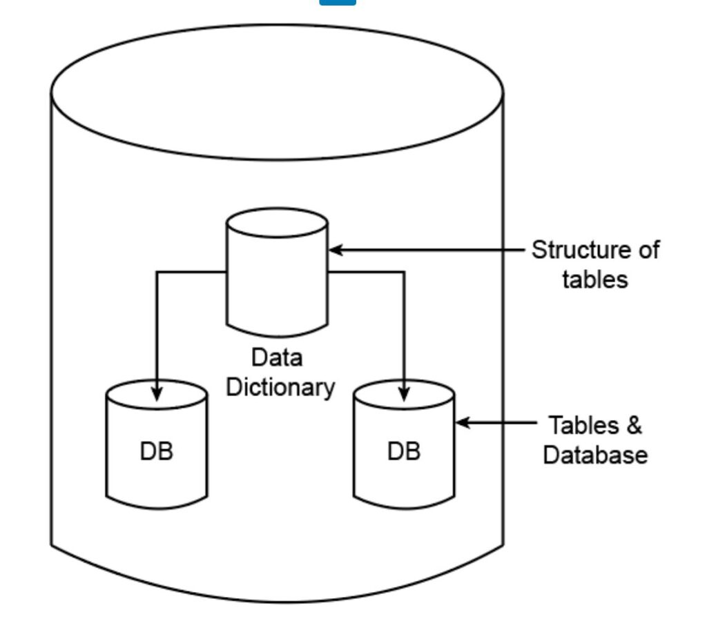

### Why It’s Important in Requirement Analysis:

- Clarifies Data Requirements:

  - Clearly defines all data elements needed by the system.

- Supports Data Flow Diagrams (DFDs):

  - Every data item flowing in DFDs should be described in the data dictionary.

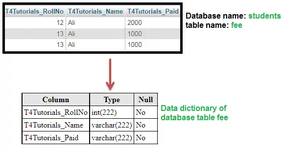

### Purpose of a Data Dictionary:

- Maintain consistency in data naming and usage.
- Facilitate communication among developers, analysts, and stakeholders.
- Serve as a reference during system design, development, and maintenance.

## Decision Tree

A Decision Tree is a tree-like model used for decision-making, where:

- Each internal node represents a decision/test on an attribute.
- Each branch represents an outcome of the decision.
- Each leaf node represents a final decision or result.

It is used to map out different possible outcomes based on a series of conditions or choices.

### Scenario (Requirement):

A user can log in only if:

- The username exists in the system.
- The password is correct.
- The account is not locked.
- If two-factor authentication (2FA) is enabled, it must also pass.

### decision tree rep

```pgsql
                  Is username valid?
                   /            \
                No              Yes
               /                  \
         Show error        Is password correct?
                               /        \
                             No          Yes
                            /              \
                      Show error     Is account locked?
                                          /     \
                                       Yes       No
                                      /            \
                          Show "Account locked"   Is 2FA enabled?
                                                     /      \
                                                  No         Yes
                                                 /             \
                                            Allow login     Is 2FA correct?
                                                               /     \
                                                             No       Yes
                                                            /           \
                                                  Show 2FA error    Allow login
```

**Root Node: The first decision point.**

## Decision Table

A decision table is a structured way to represent `conditions` and `actions` for all possible combinations, especially useful when the logic gets complex.

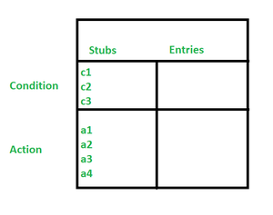

### Conditions:

c1: Is username valid?

c2: Is password correct?

c3: Is account locked?

### Actions:

a1: Show "Invalid username"

a2: Show "Incorrect password"

a3: Show "Account locked"

a4: Allow login

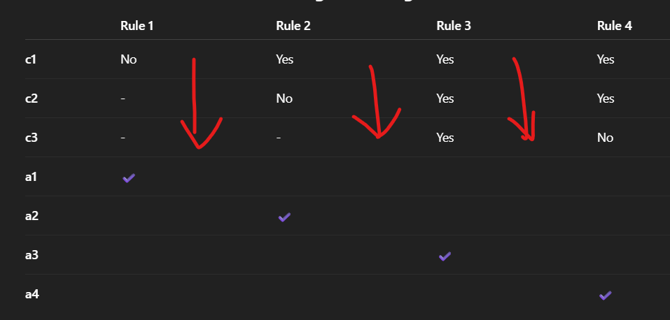

### Rule Breakdown:

- Rule 1: Invalid username → Show a1.
- Rule 2: Valid username, wrong password → Show a2.
- Rule 3: Valid username/password, but account locked → Show a3.
- Rule 4: All conditions valid → Allow login (a4).

## Structured Query / Structurerd English

Structured English is a pseudo-code style of writing, that combines natural language (English) with programming logic structures.

It's used during system analysis to clearly define process logic without needing actual code.

used to describe how processes work in a system.

### Characteristics

- Uses simple, clear English.

- Incorporates logic keywords like:

  - `IF`, `THEN`, `ELSE`
  - `WHILE`, `FOR`, `DO`
  - `CASE`, `REPEAT`, etc.

- Doesn't require programming knowledge to understand.

- Easy for both technical and non-technical stakeholders to read.

### Example

```
IF customer type is 'Premium' THEN
    discount = 20%
ELSE IF customer type is 'Regular' THEN
    discount = 10%
ELSE
    discount = 0%
END IF
```

## Psudo Code :

Pseudocode is an informal, high-level description of an algorithm or process written in plain English (or any natural language) with a programming-like structure.

It doesn’t follow any specific syntax like a programming language but **follows logical steps that can later be translated into real code**.

more close to programming

- Written in a format that looks like code but isn’t.
- Uses logic keywords
- Shows the sequence, decision-making, and loops.

### Example : Find the largest of three numbers

```text
START
INPUT A, B, C

IF A > B AND A > C THEN
    PRINT "A is the largest"
ELSE IF B > C THEN
    PRINT "B is the largest"
ELSE
    PRINT "C is the largest"
END IF

END
```

### Sum of first N pos number

```text
START
INPUT N
SET sum = 0

FOR i = 1 TO N DO
    sum = sum + i
END FOR

PRINT sum
END
```

| Feature            | Structured English            | Pseudocode                        |
| ------------------ | ----------------------------- | --------------------------------- |
| Audience           | Analysts, stakeholders        | Developers, computer scientists   |
| Language Style     | Plain English + logic         | Programming-style logic           |
| Usage              | Process specification in DFDs | Algorithm design                  |
| Syntax             | No syntax rules               | Semi-formal, consistent structure |
| Conversion to Code | Not direct                    | Easy to convert into code         |

# Requirement Engineering

Requirement Engineering (RE) is the process of **collecting**, **analyzing**, **documenting**, and **managing** the `needs and requirements `of a software system from stakeholders.

> It’s how we understand what the user wants and turn it into clear instructions for developers.

## Phases of Requirement Engineering Process

> Notes : page 85

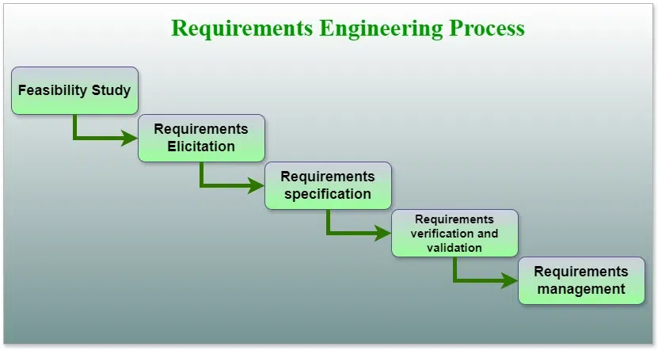

### 1. F**easibility Study**

Check if the project is practically and economically possible

Types of feasibility:

- `Technical`: Can we build it with available tech?
- `Economic`: Is it cost-effective?
- `Operational`: Will users accept and use it?
- `Schedule`: Can we finish it on time?

### 2. R**equirement Elicitation** (Gathering)

Gather requirements from users and stakeholders

Techniques: Interviews, surveys, brainstorming, observation

### 3. R**equirement Analysis**

Study requirements and resolve conflicts in the gathered requirements

### 4. **Requirement Specification**

Write a clear and detailed document

Usually results in an SRS (Software Requirements Specification)

### 5. **Requirement Validation**

Check: Are these requirements correct and complete?

Reviews, walk-through

### 6. **Requirement Management**

Track changes to requirements during development

Keep everything updated and controlled

# Feasibility Study :

> page : 91

---

# Information modeling / Data Modeling

>page: 95               